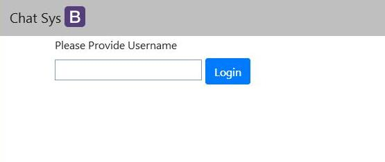
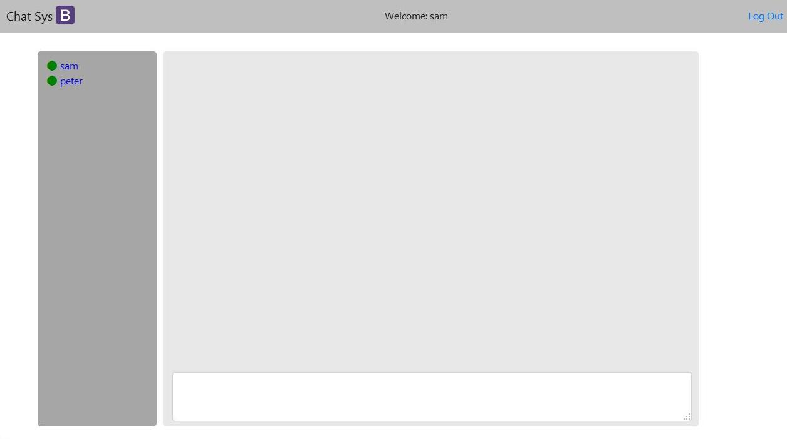
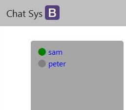
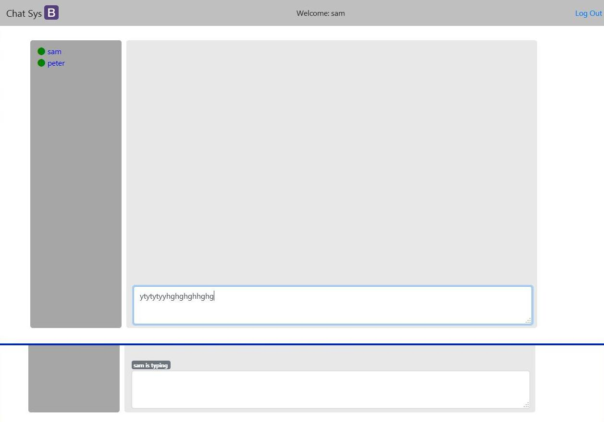
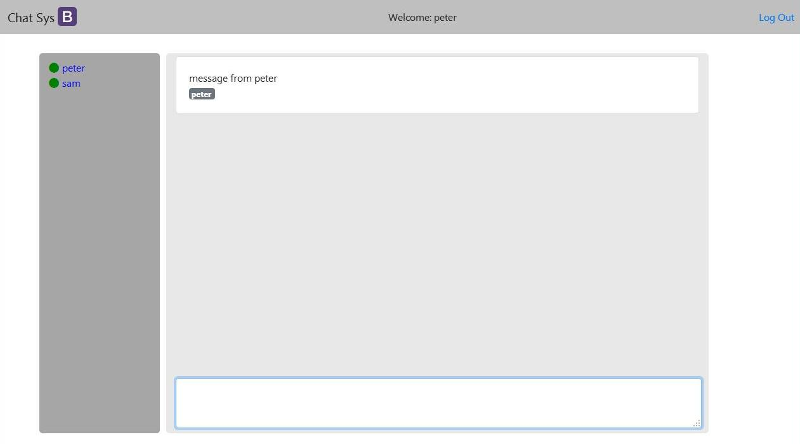

#Chat App in NodeJS
Ever so interested in sockets I've decided to try it out with NodeJS since it's basically javascript ontop of C as a server-side framework.

I created the project using express recommended parameters

> express --view=pug `appname`

At the time I didn't know `pug` was a template syntax which unlike jinja looks very little like html, on the plus side end up with a shorter tidier html template.

The project runs using nodemon 

> nodemon `appname`

You can fake login, no password necessary

And open another tab and login as many users as you want

The logout link will "log you out" by removing you're name on the list of other open tabs

If you also close the tab you get a grey icon next to your icon meaning you're now unavailable same as losing your connection to the internet.

If you open a new tab and enter the same username your icon on the other tabs will turn back to green (online)

There's also the `user is typing` or `user1, user2 is typing` if more than one which ends as soon as the user's focus on the textarea stops.

And finally my way of presenting the messages from the user. To submit some text just press `Enter`

So far I've not used a db because it was glitchy and I was just getting into NodeJS just for the sockets alone.